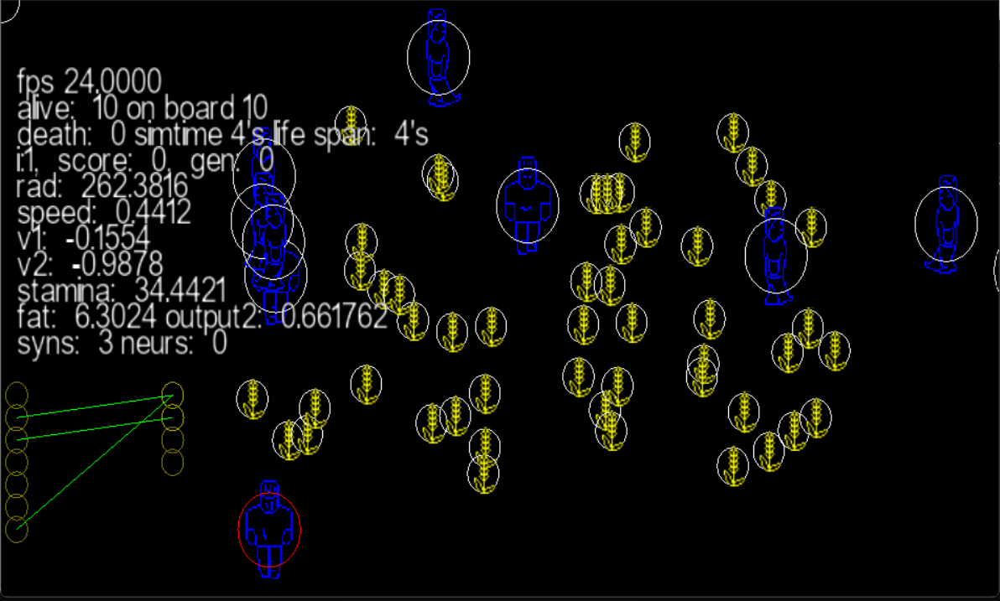

# BYTIKS - a society made in IT

## What is it?
Bytiks is small simulator with a grand goal of creating artificial society. The end point is something akin to what can be seen in Tron: Legacy movie, which is original inspiration.

## How it's done?
Bytiks uses Artificial Neural Networks as brains for it's main agents and is rendered using LuaEngine written by Enter1he.

## What they can do?
In current version of simulator they basically capable of locating and eating plants. However I'm trying to implement basic system for 
distinguishing different objects based on ID's.

This is an official github of Bytiks - IT life simulator where author Enter1he publishes source code for latest version of Bytiks.

